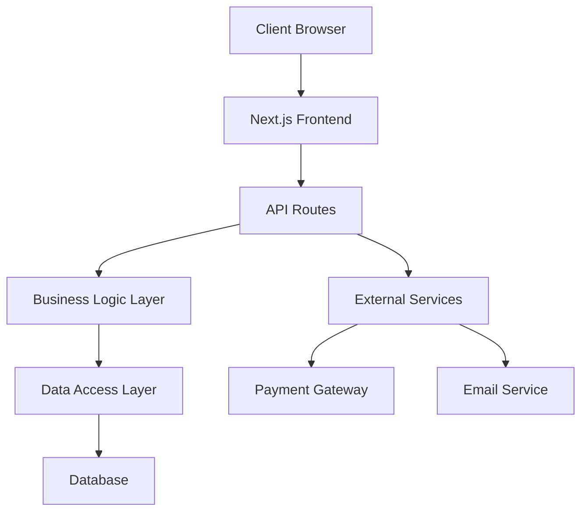

# Fruit E-commerce Design Document

## Overview

This design document outlines the architecture and implementation approach for a comve fruit e-commerce platform built with Next.js 15, React 19, TypeScript, and Tailwind CSS. The system will leverage modern web technologies to provide a fast, scalable, and user-friendly shopping experience for customers and a powerful management interface for administrators.

The platform will utilize Next.js App Router for optimal performance with server-side rendering, API routes for backend functionality, and a component-based architecture for maintainable and reusable UI elements.

## Architecture

### High-Level Architecture



### Technology Stack

- **Frontend**: Next.js 15 with App Router, React 19, TypeScript
- **Styling**: Tailwind CSS for responsive design
- **Database**: SQLite for development, PostgreSQL for production
- **Authentication**: NextAuth.js for secure authentication
- **Payment Processing**: Stripe for payment handling
- **Email**: Nodemailer with SMTP provider
- **Image Storage**: Next.js built-in image optimization
- **State Management**: React Context API and useState/useReducer hooks
- **Form Handling**: React Hook Form with Zod validation

### Folder Structure

```
src/
├── app/
│   ├── (auth)/
│   │   ├── login/
│   │   └── register/
│   ├── (customer)/
│   │   ├── cart/
│   │   ├── checkout/
│   │   ├── orders/
│   │   └── profile/
│   ├── (admin)/
│   │   ├── dashboard/
│   │   ├── products/
│   │   ├── orders/
│   │   └── users/
│   ├── api/
│   │   ├── auth/
│   │   ├── products/
│   │   ├── orders/
│   │   ├── users/
│   │   └── payments/
│   ├── products/
│   └── globals.css
├── components/
│   ├── ui/
│   ├── forms/
│   ├── layout/
│   └── features/
├── lib/
│   ├── auth/
│   ├── database/
│   ├── utils/
│   └── validations/
├── types/
└── hooks/
```

## Components and Interfaces

### Core Data Types

```typescript
interface User {
  id: string;
  email: string;
  name: string;
  role: "customer" | "admin";
  addresses: Address[];
  createdAt: Date;
  updatedAt: Date;
}

interface Product {
  id: string;
  name: string;
  description: string;
  price: number;
  category: string;
  images: string[];
  stock: number;
  isActive: boolean;
  createdAt: Date;
  updatedAt: Date;
}

interface CartItem {
  productId: string;
  quantity: number;
  price: number;
}

interface Order {
  id: string;
  userId: string;
  items: OrderItem[];
  totalAmount: number;
  status: "pending" | "processing" | "shipped" | "delivered" | "cancelled";
  shippingAddress: Address;
  paymentStatus: "pending" | "paid" | "failed";
  createdAt: Date;
  updatedAt: Date;
}

interface Address {
  id: string;
  street: string;
  city: string;
  state: string;
  zipCode: string;
  country: string;
  isDefault: boolean;
}
```

### Key Components

#### Customer Components

- **ProductGrid**: Displays products in a responsive grid layout
- **ProductCard**: Individual product display with image, price, and add to cart
- **ShoppingCart**: Cart sidebar with item management
- **CheckoutForm**: Multi-step checkout process
- **OrderHistory**: Customer order tracking and history
- **ProductSearch**: Search and filter functionality

#### Admin Components

- **AdminDashboard**: Overview of sales, orders, and inventory
- **ProductManager**: CRUD operations for products
- **OrderManager**: Order processing and status updates
- **UserManager**: Customer account management
- **InventoryTracker**: Stock level monitoring and alerts

#### Shared Components

- **Header**: Navigation with cart, user menu, and search
- **Footer**: Site links and information
- **AuthForms**: Login and registration forms
- **LoadingSpinner**: Loading states throughout the app
- **Modal**: Reusable modal component
- **Toast**: Notification system

## Data Models

### Database Schema

```sql
-- Users table
CREATE TABLE users (
  id UUID PRIMARY KEY DEFAULT gen_random_uuid(),
  email VARCHAR(255) UNIQUE NOT NULL,
  name VARCHAR(255) NOT NULL,
  password_hash VARCHAR(255) NOT NULL,
  role VARCHAR(20) DEFAULT 'customer',
  created_at TIMESTAMP DEFAULT NOW(),
  updated_at TIMESTAMP DEFAULT NOW()
);

-- Products table
CREATE TABLE products (
  id UUID PRIMARY KEY DEFAULT gen_random_uuid(),
  name VARCHAR(255) NOT NULL,
  description TEXT,
  price DECIMAL(10,2) NOT NULL,
  category VARCHAR(100),
  images TEXT[], -- Array of image URLs
  stock INTEGER DEFAULT 0,
  is_active BOOLEAN DEFAULT true,
  created_at TIMESTAMP DEFAULT NOW(),
  updated_at TIMESTAMP DEFAULT NOW()
);

-- Orders table
CREATE TABLE orders (
  id UUID PRIMARY KEY DEFAULT gen_random_uuid(),
  user_id UUID REFERENCES users(id),
  total_amount DECIMAL(10,2) NOT NULL,
  status VARCHAR(20) DEFAULT 'pending',
  payment_status VARCHAR(20) DEFAULT 'pending',
  shipping_address JSONB,
  created_at TIMESTAMP DEFAULT NOW(),
  updated_at TIMESTAMP DEFAULT NOW()
);

-- Order items table
CREATE TABLE order_items (
  id UUID PRIMARY KEY DEFAULT gen_random_uuid(),
  order_id UUID REFERENCES orders(id),
  product_id UUID REFERENCES products(id),
  quantity INTEGER NOT NULL,
  price DECIMAL(10,2) NOT NULL
);

-- Addresses table
CREATE TABLE addresses (
  id UUID PRIMARY KEY DEFAULT gen_random_uuid(),
  user_id UUID REFERENCES users(id),
  street VARCHAR(255) NOT NULL,
  city VARCHAR(100) NOT NULL,
  state VARCHAR(100) NOT NULL,
  zip_code VARCHAR(20) NOT NULL,
  country VARCHAR(100) NOT NULL,
  is_default BOOLEAN DEFAULT false
);
```

### API Endpoints

#### Authentication

- `POST /api/auth/register` - User registration
- `POST /api/auth/login` - User login
- `POST /api/auth/logout` - User logout
- `GET /api/auth/me` - Get current user

#### Products

- `GET /api/products` - Get all products (with pagination and filters)
- `GET /api/products/[id]` - Get single product
- `POST /api/products` - Create product (admin only)
- `PUT /api/products/[id]` - Update product (admin only)
- `DELETE /api/products/[id]` - Delete product (admin only)

#### Orders

- `GET /api/orders` - Get user orders or all orders (admin)
- `GET /api/orders/[id]` - Get single order
- `POST /api/orders` - Create new order
- `PUT /api/orders/[id]` - Update order status (admin only)

#### Users

- `GET /api/users/profile` - Get user profile
- `PUT /api/users/profile` - Update user profile
- `GET /api/users` - Get all users (admin only)

#### Payments

- `POST /api/payments/create-intent` - Create Stripe payment intent
- `POST /api/payments/confirm` - Confirm payment

## Error Handling

### Client-Side Error Handling

- **Form Validation**: Real-time validation using Zod schemas
- **API Error Handling**: Centralized error handling with user-friendly messages
- **Network Errors**: Retry mechanisms and offline state handling
- **404 Errors**: Custom not found pages for products and routes

### Server-Side Error Handling

- **API Route Errors**: Consistent error response format
- **Database Errors**: Connection handling and query error management
- **Authentication Errors**: Proper HTTP status codes and error messages
- **Payment Errors**: Stripe error handling and user notification

### Error Response Format

```typescript
interface ApiError {
  success: false;
  error: {
    code: string;
    message: string;
    details?: any;
  };
}

interface ApiSuccess<T> {
  success: true;
  data: T;
}
```

## Testing Strategy

### Unit Testing

- **Components**: React Testing Library for component behavior
- **Utilities**: Jest for utility function testing
- **API Routes**: Supertest for endpoint testing
- **Database**: In-memory database for isolated testing

### Integration Testing

- **User Flows**: End-to-end testing with Playwright
- **Payment Flow**: Stripe test mode integration
- **Authentication**: Complete auth flow testing

### Performance Testing

- **Load Testing**: API endpoint performance under load
- **Frontend Performance**: Lighthouse CI for performance metrics
- **Database Performance**: Query optimization and indexing

### Testing Tools

- **Jest**: Unit testing framework
- **React Testing Library**: Component testing
- **Playwright**: End-to-end testing
- **MSW**: API mocking for tests

## Security Considerations

### Authentication & Authorization

- **Password Security**: Bcrypt hashing with salt rounds
- **JWT Tokens**: Secure token generation and validation
- **Role-Based Access**: Middleware for admin route protection
- **Session Management**: Secure session handling with NextAuth.js

### Data Protection

- **Input Validation**: Server-side validation for all inputs
- **SQL Injection Prevention**: Parameterized queries
- **XSS Protection**: Content sanitization and CSP headers
- **CSRF Protection**: Built-in Next.js CSRF protection

### Payment Security

- **PCI Compliance**: Stripe handles sensitive payment data
- **Secure Transmission**: HTTPS enforcement
- **Payment Validation**: Server-side payment verification

## Performance Optimization

### Frontend Optimization

- **Code Splitting**: Automatic code splitting with Next.js
- **Image Optimization**: Next.js Image component with lazy loading
- **Caching**: Browser caching and service worker implementation
- **Bundle Analysis**: Regular bundle size monitoring

### Backend Optimization

- **Database Indexing**: Proper indexing for query performance
- **API Caching**: Redis caching for frequently accessed data
- **Connection Pooling**: Database connection optimization
- **Rate Limiting**: API rate limiting to prevent abuse

### SEO Optimization

- **Server-Side Rendering**: Next.js SSR for better SEO
- **Meta Tags**: Dynamic meta tags for products
- **Structured Data**: JSON-LD for rich snippets
- **Sitemap**: Automatic sitemap generation
